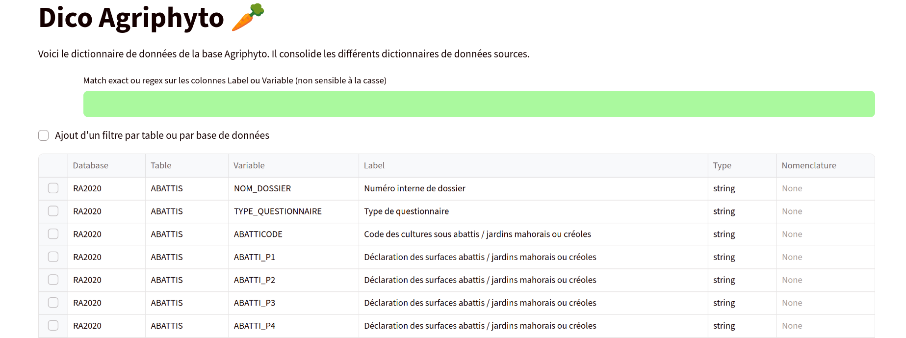

# agriphyto-schema

---

## Description

- Objectif du projet : Disposer d'un schéma de données standardisé et d'une visualisation ergonomique du dictionnaire de données pour les données de la base Agrophyto.
- Livrables : schéma de données (standard [pandera](https://pandera.readthedocs.io/en/stable/)) et application du dictionnaire.
- Public visé : utilisateurs de la base Agrophyto.
- Acteurs impliqués : D2E, Insee.
- Temporalité du projet : octobre 2025 pour le prototype.

## Liens utiles

- Documentation : https://straymat.github.io/agrophyto-schema/readme.html
- Code source : https://github.com/straymat/agrophyto-schema

## Contexte technique

### Données utilisées

Bases de données composant Agriphyto. Seuls les dictionnaires des dernières
années pour chaque base sont intégrés dans ce projet.

Si une documentation propre est disponible sur le CASD, l'id_prod de la dernière
édition disponible est indiqué. Il faut ensuite visiter la page :
https://www.casd.eu/page-produit/?id_prd={id_prod}. Une version consolidée du
dictionnaire est disponible en téléchargement.

| Sigle | Nom | Année | CASD id_prod | intégrée | choix fichier source nomenclature |
|-------|-----|-------|--------------|----------|-----------------------------------|
| PKGC | Pratiques Culturales Grandes Cultures | 2006, 2011, 2017 | 3033 | | 20190802_DOC_BSVA_dico_variables_PKGC2017.ods |
| PKPrairies | Pratiques Culturales Prairies (regroupées dans Grandes Cultures à partir de 2017) | 2006, 2011 | 1158 | ✅ | Pratiques_culturales_en_prairie_-_2011.csv |
| PKfruits | Pratiques Culturales Fruits (aussi nommé PKArbo) | 2015 | 2597 | ✅ | 20210726_PKfruits2015_dico_variables.ods|
| PKLEG | Pratiques Culturales Légumes | 2013 | 1393 | ✅ | PKLEG13_DESC.ods |
| PhytoViti | Phytosanitaires Viticulture | 2010, 2016 | 2609 | ✅ | Pratiques_phytosanitaires_en_viticulture_-_2016.csv|
| PKViti | Pratiques Culturales Viticulture | 2006, 2014, 2019 | 4173 | ✅ | PKViti2019_dico_variables_definitif.ods |
| PhytoGC | Phytosanitaires Grandes Cultures | 2014 | 1639 | ✅ | Pratiques_phytosanitaires_en_grandes_cultures_-_2014.csv |
| Phytoleg | Phytosanitaires Légumes | 2018 | 3836 | | 20210930_DOC_BSVA_Dictionnaire_variables_Phytolégumes2018.ods |
| Phytofruits | Phytosanitaires Fruits | 2012, 2018 | 3945 | | Phytofruits18_dico_variables_casd.xlsx |
| RA | Recensement Agricole | 2000, 2010, 2020 | 4411 | ✅ | RA2020_Dictionnaire des variables_220415_CASD.xlsx |
| Fideli | Fideli | 2018-2023 | 5169 | ✅ | Fichier_Démographique_sur_les_Logements_et_les_Individus_(FIDELI)_-_2022.csv |
| BTS | Base tous salariés | 2016-2023 | 5012 | | |
| BNS | Base non salariés | 2006-2023 | 4848 | | |

### Schéma flux de données (optionnel)

### Technologies

python 3.13, pandera, streamlit

### Maintenance

- Projet en développement actif

## Contacts

D2E, division RPS ou macro : matthieu.doutreligne@insee.fr

## Détails techniques

Se référer à la documentation en ligne : https://straymat.github.io/agrophyto-schema/readme.html
